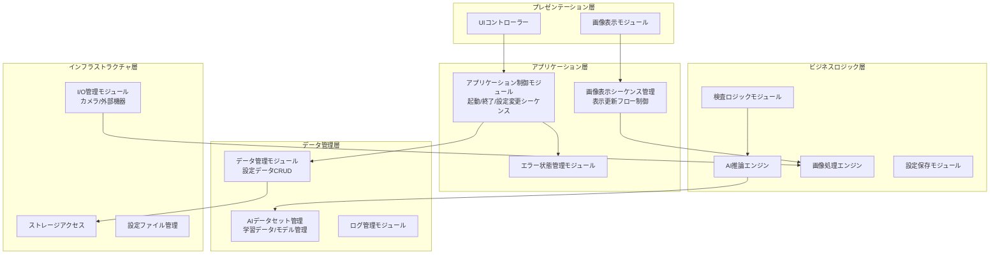

```mermaid
graph TB
    subgraph "プレゼンテーション層"
        UI[UIコントローラー]
        Display[画像表示モジュール]
    end

    subgraph "アプリケーション層"
        App[アプリケーション制御モジュール<br/>起動/終了/設定変更シーケンス]
        Display_Seq[画像表示シーケンス管理<br/>表示更新フロー制御]
        Validation[エラー状態管理モジュール]
    end

    subgraph "ビジネスロジック層"
        Inspection[検査ロジックモジュール]
        AI_Engine[AI推論エンジン]
        Image_Proc[画像処理エンジン]
	Save_Proc[設定保存モジュール]
    end

    subgraph "データ管理層"
        Data_Mgr[データ管理モジュール<br/>設定データCRUD]
        AI_Dataset[AIデータセット管理<br/>学習データ/モデル管理]
        Log_Mgr[ログ管理モジュール]
    end

    subgraph "インフラストラクチャ層"
        IO_Mgr[I/O管理モジュール<br/>カメラ/外部機器]
        Storage[ストレージアクセス]
        Config[設定ファイル管理]
    end

    UI --> App
    Display --> Display_Seq
    App --> Validation
    App --> Data_Mgr
    Display_Seq --> Image_Proc
    Inspection --> AI_Engine
    AI_Engine --> AI_Dataset
    Data_Mgr --> Storage
    IO_Mgr --> Image_Proc
```
